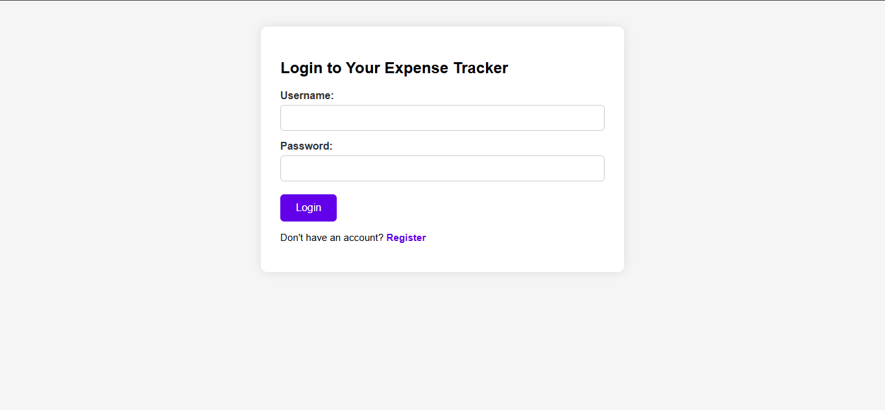
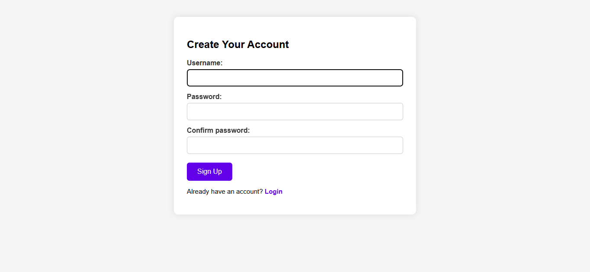
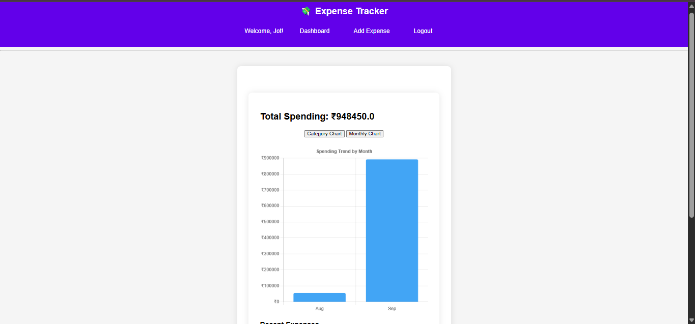

# 💸 Expense Tracker (Django)

A full‑stack web application built with **Python + Django** to help users securely track their expenses, visualize spending patterns, and manage budgets.  
This project was developed as part of my BCA final year work and refined with modern UI/UX features.

---

## 🚀 Features
- 🔑 User authentication (signup, login, logout)
- 📝 Add, edit, and delete expenses
- 📊 Interactive charts with **Chart.js**
- 📱 Responsive design for desktop and mobile
- 🎨 Consistent UI across login, signup, and dashboard

---

## 🛠 Tech Stack
- **Backend:** Python, Django  
- **Frontend:** HTML, CSS, JavaScript  
- **Visualization:** Chart.js  
- **Database:** SQLite (development), PostgreSQL (production ready)

---

## ⚙️ Installation & Setup

1. **Clone the repository**
   ```bash
   git clone https://github.com/Coder1290/expense-tracker.git
   cd expense-tracker

2. **Create a virtual environment and activate it**
   ```bash
   python -m venv env
   env\Scripts\activate   # On Windows
   source env/bin/activate  # On Mac/Linux

3. **Install dependencies**
   ```bash
   pip install -r requirements.txt

4. **Run migrations**
   ```bash
   python manage.py migrate

5. **Start the development server**
   ```bash
    python manage.py runserver

6. Open in browser 👉 http://127.0.0.1:8000/

---

## 📸 Screenshots

### 🔐 Login Page


### 📝 Signup Page


### 📊 Dashboard


---

## 👤 Author
**Kuljinder Singh**  
🎓 Final Year BCA Student | 💻 Aspiring Full Stack Python Developer  
GitHub: [Coder1290](https://github.com/Coder1290)

